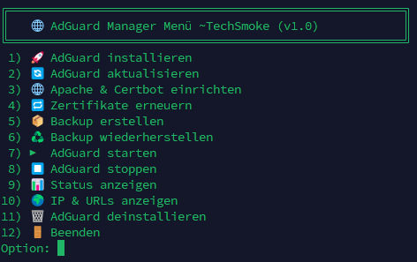
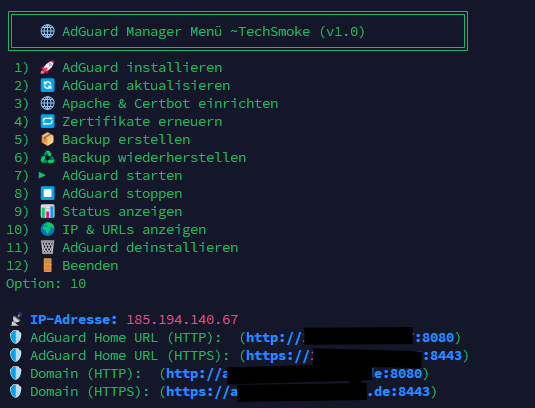

# AdGuard Home Manager

> 🌐 Ein benutzerfreundliches Bash-Menü zur Verwaltung von AdGuard Home – inklusive Backup, SSL, Apache & mehr.  
> 🌐 A user-friendly Bash menu for managing AdGuard Home – including backup, SSL, Apache & more.

---

## 🇩🇪 Übersicht / 🇬🇧 Overview

**AdGuard Home Manager** ist ein interaktives Shell-Skript zur einfachen Steuerung und Verwaltung einer AdGuard Home Installation.  
**AdGuard Home Manager** is an interactive shell script to manage and control your AdGuard Home installation easily.

Es bietet ein farbiges Menü mit Icons und deckt alle wichtigen Funktionen ab:  
It provides a colorful menu with icons and covers all key features:

- 🚀 Installation von AdGuard Home / AdGuard Home installation
- 🔄 Update-Funktion / Update function
- 🌐 Apache2 + Certbot Integration (inkl. SSL) / Apache2 + Certbot integration (incl. SSL)
- 📦 Backup & Wiederherstellung / Backup & restore
- ▶️ Start / ⏹️ Stopp / 📊 Statusanzeige / Start / Stop / Status check
- 🌍 Anzeige aller relevanten IP/URL-Zugänge / Show IP/URL access info
- 🗑️ Vollständige Deinstallation / Full uninstallation

---

## ℹ️ Menü-Funktionen im Detail / Menu features in detail

### 🚀 Installation
- 🇩🇪 Berücksichtigung belegter Ports (DNS, HTTP, HTTPS, WebUI)
- 🇬🇧 Checks for occupied ports (DNS, HTTP, HTTPS, WebUI)
- 🇩🇪 Benutzer wird bei Kollision zur Eingabe alternativer Ports aufgefordert
- 🇬🇧 User prompted to enter alternative ports if taken
- 🇩🇪 Automatische Installation über offizielles Installationsskript
- 🇬🇧 Installs via official AdGuard installation script
- 🇩🇪 Zeigt IP und Webzugang nach Installation
- 🇬🇧 Shows IP and access info after installation

### 🔄 Update
- 🇩🇪 Führt offizielles AdGuard Update durch
- 🇬🇧 Performs official AdGuard update

### 🌐 Apache & Certbot einrichten / Setup
- 🇩🇪 Eigene Domain kann angegeben werden
- 🇬🇧 Enter your own domain name
- 🇩🇪 Apache wird installiert, falls nicht vorhanden
- 🇬🇧 Apache is installed if not present
- 🇩🇪 SSL-Zertifikat wird automatisch erstellt
- 🇬🇧 SSL certificate automatically created via Certbot
- 🇩🇪 Apache-Konfiguration wird an HTTPS-Port angepasst
- 🇬🇧 Apache config updated with correct HTTPS port

### 🔁 Zertifikate erneuern / Renew certificates
- 🇩🇪 Zertifikate werden via `certbot renew` aktualisiert
- 🇬🇧 Certificates renewed via `certbot renew`

### 📦 Backup erstellen / Create backup
- 🇩🇪 Sichert AdGuard nach /opt/AdGuardHome
- 🇬🇧 Backs up AdGuard from /opt/AdGuardHome
- 🇩🇪 Max. 3 Backups werden aufbewahrt
- 🇬🇧 Keeps up to 3 backup versions

### ♻️ Backup wiederherstellen / Restore backup
- 🇩🇪 Zeigt Backup-Auswahlmenü
- 🇬🇧 Shows backup selection menu
- 🇩🇪 Stoppt Dienst, stellt wieder her
- 🇬🇧 Stops service before restoring

### ▶️ / ⏹️ Start / Stopp
- 🇩🇪 Startet oder stoppt AdGuard Dienst
- 🇬🇧 Starts or stops AdGuard service

### 📊 Status anzeigen / Show status
- 🇩🇪 Prüft, ob AdGuard läuft
- 🇬🇧 Checks if AdGuard is running

### 🌍 IP & URLs anzeigen / Show IP & URLs
- 🇩🇪 Zeigt IP + HTTP/HTTPS + Domains
- 🇬🇧 Displays IP + HTTP/HTTPS + domains

### 🗑️ Deinstallation / Uninstall
- 🇩🇪 Entfernt alle AdGuard-Daten + Dienst
- 🇬🇧 Removes all AdGuard data + service

---

## 🧰 Voraussetzungen / Requirements

- Bash
- curl / wget
- systemd (für Service-Verwaltung) / for service management
- root oder sudo-Rechte / root or sudo privileges

---

## 🧑‍💻 Installation

```bash
chmod +x adguard_manager.sh
./adguard_manager.sh
```

---

## 📷 Screenshots

### 📋 Menü / Menu



### 🌍 IP-Informationen / IP Info



---

## 📜 Lizenz / License

MIT License – Feel free to use & modify.

### ⚠️ Haftungsausschluss / Disclaimer

🇩🇪 Dieses Skript wird ohne jegliche Gewährleistung bereitgestellt. Der Autor übernimmt keine Verantwortung für Schäden, Fehlfunktionen oder Datenverluste, die durch die Nutzung dieses Skripts entstehen könnten. Nutzung auf eigene Gefahr!

🇬🇧 This script is provided without any warranty. The author is not responsible for any damage, malfunction, or data loss resulting from its use. Use at your own risk.
